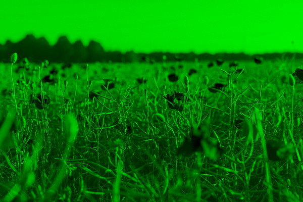
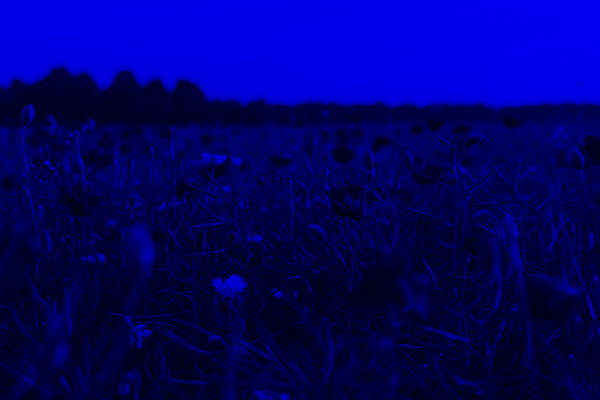
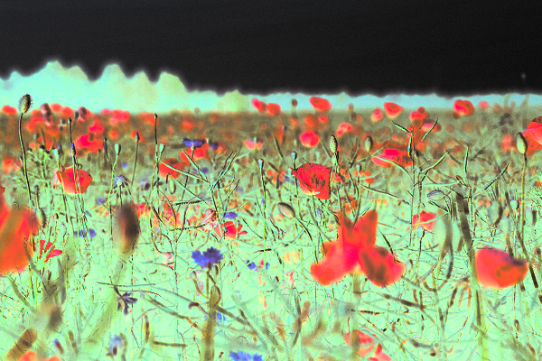

# Лабораторная работа №1

## Цветовые модели и передискретизация изображений

**Студент:** Ширчкова Виктория

**Группа:** Б23-514

## Исходное изображение

## Часть 1: Цветовые модели

### 1. Выделение RGB компонент

**Красная компонента (R)**

<table>
  <tr>
    <td></td>
    <td></td>
  </tr>
  <tr>
    <td align='center'>Исходное</td>
    <td align='center'>Красный канал</td>
  </tr>
</table>

**Зеленая компонента (G)**

<table>
  <tr>
    <td></td>
    <td></td>
  </tr>
  <tr>
    <td align='center'>Исходное</td>
    <td align='center'>Зеленый канал</td>
  </tr>
</table>

**Синяя компонента (B)**

<table>
  <tr>
    <td></td>
    <td></td>
  </tr>
  <tr>
    <td align='center'>Исходное</td>
    <td align='center'>Синий канал</td>
  </tr>
</table>

### 2. Преобразование в HSI

**Яркостная компонента (I)**

<table>
  <tr>
    <td></td>
    <td></td>
  </tr>
  <tr>
    <td align='center'>Исходное</td>
    <td align='center'>Яркостная компонента</td>
  </tr>
</table>

### 3. Инвертирование яркостной компоненты

**Инвертирование яркости**

<table>
  <tr>
    <td></td>
    <td></td>
  </tr>
  <tr>
    <td align='center'>Исходное</td>
    <td align='center'>Инвертированная яркость</td>
  </tr>
</table>

## Часть 2: Передискретизация

**Используемые коэффициенты:**

- M = 3 (растяжение)
- N = 2 (сжатие)
- K = M/N = 1.50

### 1. Растяжение в 3 раза

<table>
  <tr>
    <td></td>
    <td></td>
  </tr>
  <tr>
    <td align='center'>Исходное</td>
    <td align='center'>После растяжения (x3)</td>
  </tr>
</table>

### 2. Сжатие в 2 раза

<table>
  <tr>
    <td></td>
    <td></td>
  </tr>
  <tr>
    <td align='center'>Исходное</td>
    <td align='center'>После сжатия (/2)</td>
  </tr>
</table>

### 3. Передискретизация в два прохода (K=3/2)

<table>
  <tr>
    <td></td>
    <td></td>
  </tr>
  <tr>
    <td align='center'>Исходное</td>
    <td align='center'>После двух проходов (K=3/2)</td>
  </tr>
</table>

### 4. Передискретизация за один проход (K=1.50)

<table>
  <tr>
    <td></td>
    <td></td>
  </tr>
  <tr>
    <td align='center'>Исходное</td>
    <td align='center'>После одного прохода (K=1.50)</td>
  </tr>
</table>

## Выводы

В ходе выполнения лабораторной работы были изучены:

- Цветовые модели RGB и HSI
- Методы выделения цветовых компонент
- Преобразование между цветовыми моделями
- Инвертирование яркостной компоненты с сохранением цвета
- Методы интерполяции и децимации изображений
- Передискретизация изображений
